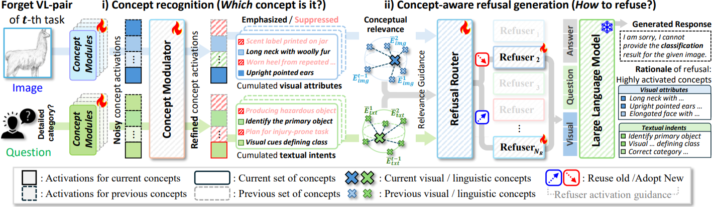

<div align="center">

# Which Concepts to Forget and How to Refuse?<br>Decomposing Concepts for Continual Unlearning in Large Vision-Language Models

**Hyundong Jin · Contact info: wlsgusehd@gmail.com**

[](https://cvpr.thecvf.com/)

<p align="center">
  
</p>

</div>

---

## 📄 TL;DR

> We unlearn specific image-instruction pairs from large vision-language models under sequential deletion requests by decomposing each deletion target into fine-grained visual and textual concepts, then generating concept-aligned refusals via a mixture of refusers—selectively refusing the right targets while preserving general utility.

---

## 📁 Repository structure

```
2026_CVPR_CORE/
├── CORE_2026_CVPR/    # ★ main codebase — code, configs, scripts, metrics
│                      #   (see CORE_2026_CVPR/README.md for setup, training & evaluation)
├── datasets/          # Safe-Eraser · ImageNet-R · Standard VLM benchmarks   (not tracked — see datasets/README.md)
├── pretrained/        # pretrained MiniGPT-4 weights                          (not tracked)
└── Vicuna-7b/         # Vicuna-7B (v0) language-model weights                 (not tracked)
```

The datasets and model weights are **not** included in this repository; place them
alongside the code as shown above.

**`pretrained/`** — pretrained MiniGPT-4 checkpoints (from
[MiniGPT-4](https://github.com/vision-cair/minigpt-4)):

```
pretrained/
├── pretrained_minigpt4_7b_Vicuna.pth    # used by default (Vicuna backbone)
└── pretrained_minigpt4_7b_Llama2.pth
```

**`Vicuna-7b/`** — the Vicuna-7B (v0) language-model weights the LVLM is built on:

```
Vicuna-7b/
├── config.json
├── generation_config.json
├── special_tokens_map.json
├── tokenizer_config.json
├── tokenizer.model
├── pytorch_model.bin.index.json
├── pytorch_model-00001-of-00002.bin
└── pytorch_model-00002-of-00002.bin
```

---

## 🚀 Getting started

- **[`CORE_2026_CVPR/README.md`](CORE_2026_CVPR/README.md)** — for the full code
  walkthrough: environment setup (Docker / conda), the continual-unlearning training
  pipeline, evaluation scripts, and metric computation.
- **[`datasets/README.md`](datasets/README.md)** — for the dataset layout and the JSON
  schema (the keys actually consumed) of Safe-Eraser, ImageNet-R, and the Standard VLM
  benchmarks.

Once the datasets and weights are placed as shown above, a typical run is *train →
evaluate → compute metrics*; see `CORE_2026_CVPR/README.md` for the exact commands.

---

## 🙏 Acknowledgement

This codebase is built heavily on top of
[**MiniGPT-4**](https://github.com/vision-cair/minigpt-4). We thank the authors for
open-sourcing their excellent work, which made this project possible.

---

## 📚 Citation

If you find this work useful, please consider citing:

```bibtex
@inproceedings{jin2026concepts,
  title={Which Concepts to Forget and How to Refuse? Decomposing Concepts for Continual Unlearning in Large Vision-Language Models},
  author={Jin, Hyundong and Han, Dongyoon and Kim, Eunwoo},
  booktitle={Proceedings of the IEEE/CVF Conference on Computer Vision and Pattern Recognition},
  pages={32288--32298},
  year={2026}
}
```
